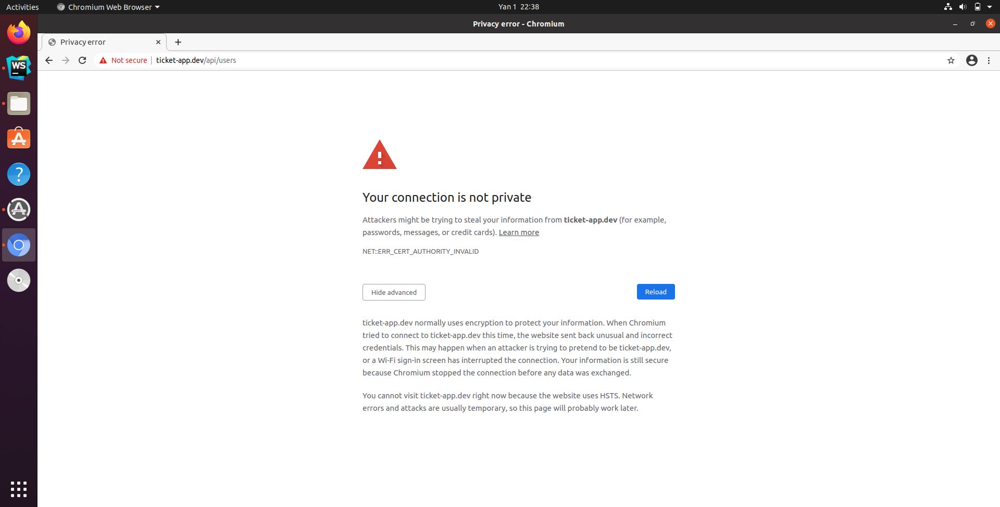

# ticket-app-microservice

###### Tested Ubuntu 20.04.1 LTS (VM)

#### 1. [Install docker](https://docs.docker.com/engine/install/ubuntu/)
#### 1. [Install kubectl](https://kubernetes.io/docs/tasks/tools/install-kubectl/)
#### 1. [Install minikube](https://minikube.sigs.k8s.io/docs/start/)
#### 2. [Install skaffold](https://skaffold.dev/docs/install/)

## Start your cluster:
#### Run `minikube start`
#### Run `minikube addons enable ingress`

## Create jwt secret
#### Run `kubectl create secret generic jwt-secret --from-literal=JWT_KEY=secret`

## Add ip for to redirect domain
#### Run `minikube ip` // Example result: `192.168.49.2`
#### Add `192.168.49.2 ticket-app.dev` in `/etc/hosts`

## Start skaffold
#### Run `skaffold dev`

## If you see one the below error please type on screen `thisisunsafe`

## Get secret list (optional)
###### Run `kubectl get secrets`

###### Permission for docker `exec /usr/bin/sg docker newgrp $(id -gn)`
